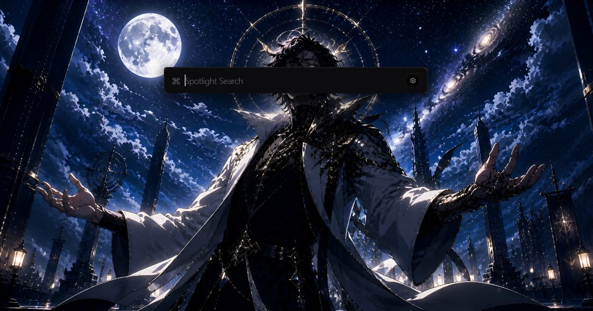
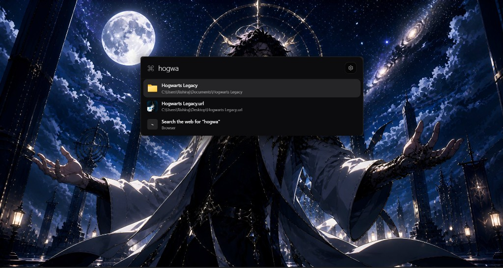

# Spotlight for Windows

Fast, beautiful, free. A keyboard-first universal launcher for Windows inspired by macOS Spotlight - offline-first, privacy-first, and fully local.

Press **Alt+Space** (configurable) to summon it, start typing to search apps, files, folders, Windows settings, or do quick math.

<p align="center">
  
  <br><br>
  
</p>

## Features

- **Unified search** - apps, files, PDFs, folders, Windows settings, and quick math, all from one search bar.
- Configurable global hotkey (default `Alt+Space`), opens in under 50ms.
- Fully local search index (SQLite + FTS5) - no cloud, no accounts, no telemetry.
- Real app/file icons, frecency-ranked results, keyboard-only navigation.
- System tray with Settings and Quit; runs quietly in the background.
- Optional web search fallback (opens your default browser) - only when you explicitly ask.

## Windows Search is broken. Spotlight isn't.

| | Windows Search | Spotlight |
|---|---|---|
| Opens instantly | Sometimes | Always, under 50ms |
| Needs the internet | Often, for "best match" web results | Never |
| Shows Bing/web results you didn't ask for | Yes | No - web search only if you explicitly ask |
| Feels like Spotlight on macOS | No | Yes - same keyboard-first, frosted, no-mouse-needed feel |
| Fully offline | No | 100% - all search happens locally on your machine |

Spotlight is the Apple-style Spotlight bar Windows never shipped - fast, frosted, and fully offline.

## Stack

- **Backend:** Rust ([Tauri](https://v2.tauri.app) v2)
- **Frontend:** React + TypeScript + Tailwind CSS v4
- **Database:** SQLite (via `rusqlite`, FTS5 full-text search)
- **Animation:** framer-motion

## Architecture

```
SearchEngine
  └─ Provider trait (App, File, Folder, Settings, Calculator)
       └─ every provider returns the same SearchResult shape
```

The `SearchEngine` (`src-tauri/src/search/`) never knows how a provider finds its data - each provider (`src-tauri/src/providers/`) is an independent module. See [docs/Architecture.md](docs/Architecture.md) for details.

## Project layout

```
src-tauri/src/
  search/      SearchEngine, Provider trait, SearchResult, Query
  providers/   AppProvider (Win32 + UWP), FileProvider, FolderProvider, SettingsProvider, CalculatorProvider
  indexer/     SQLite db, background crawler, file watcher
  icons.rs     IconCache (real file/shortcut icons)
  settings.rs  Persisted hotkey settings
  hotkey.rs    Runtime shortcut state
  window.rs    Window show/hide, vibrancy, positioning
  commands.rs  Tauri IPC commands
src/
  components/  SearchBar, ResultsList, ResultItem, ResultIcon
  SettingsApp.tsx  Hotkey settings UI
  hooks/       useSearch (debounced), useKeyboardNav
  lib/tauri.ts IPC wrapper (with browser-dev mock fallback)
docs/          Architecture, Decisions, Roadmap, Review logs
```

## Getting started

Prerequisites: [Rust](https://www.rust-lang.org/tools/install) (MSVC toolchain) and [Node.js](https://nodejs.org) 18+.

```bash
pnpm install
pnpm approve-builds esbuild   # first time only (pnpm 11+)
pnpm tauri dev
```

Use the system tray icon to open Settings or quit the app.

## Releasing (for others to download)

Build unsigned Windows installers:

```bash
pnpm tauri build
```

Outputs:

- `src-tauri/target/release/bundle/msi/Spotlight_0.2.0_x64_en-US.msi`
- `src-tauri/target/release/bundle/nsis/Spotlight_0.2.0_x64-setup.exe`

To share with others:

1. Push your code to GitHub.
2. Create a **Release** (e.g. tag `v0.2.0`).
3. Attach the `.msi` and/or `-setup.exe` as release assets.
4. Users download and run the installer.

**SmartScreen note:** These builds are not code-signed yet. Windows may show an "Unknown publisher" warning on first run. Users can click **More info** -> **Run anyway**. Code signing (paid certificate) removes this warning and is planned for a future release.

## Documentation

- [docs/Architecture.md](docs/Architecture.md) - how the pieces fit together
- [docs/Decisions.md](docs/Decisions.md) - technical decisions and why
- [docs/Roadmap.md](docs/Roadmap.md) - feature status and what's next
- [docs/Review.md](docs/Review.md) - append-only session log
